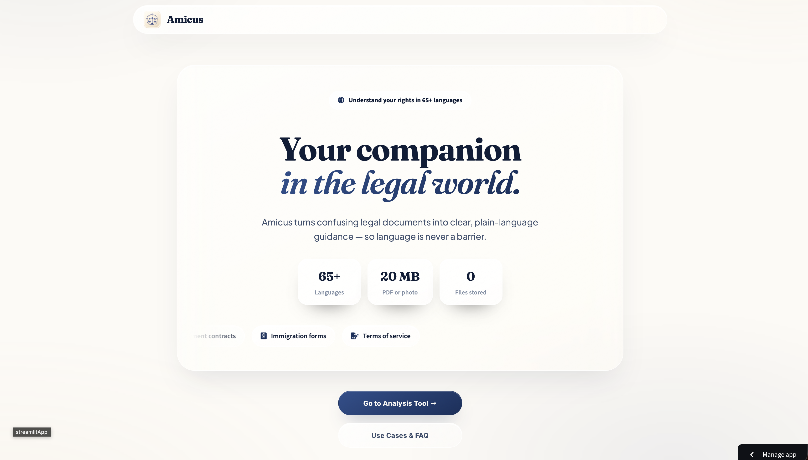
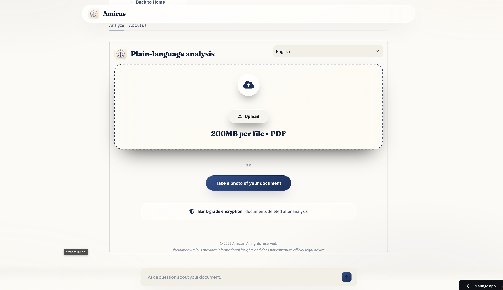
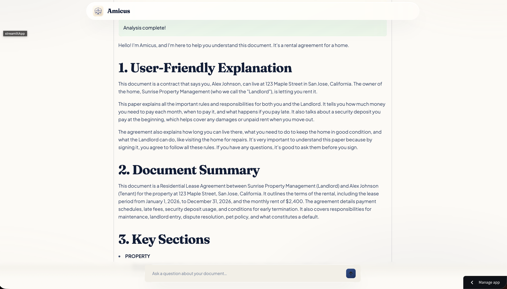
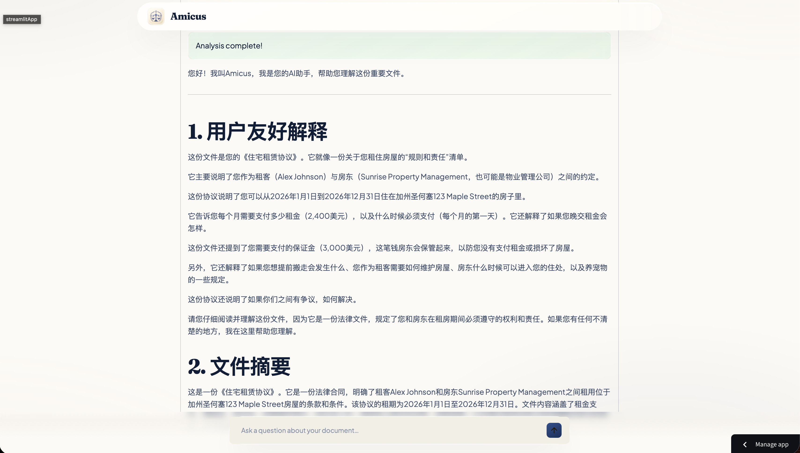
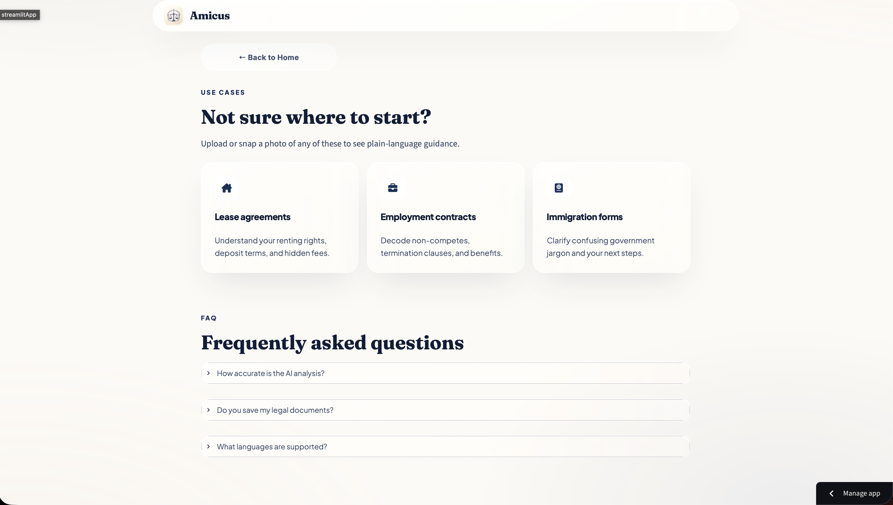

# Amillum
A Python desktop app that translates confusing legal documents into clear, 
plain-language guidance in 65+ languages, ensuring language is never a barrier 
to your safety, protection, and peace of mind.

## 🌐 Live Demo
[Click here to try it](https://amicusai.streamlit.app)

---

## 📸 Screenshots

### Home — Your Legal Companion


### ⚖️ Document Upload — PDF & Camera Input


### 🌐 Plain-Language Analysis


### 🗣️ Multi-Language Analysis


### 💡 Use Cases & FAQ


---

## Why I Built This
Navigating the legal system can be overwhelming, especially when language 
barriers stand in the way of justice. For residents with Limited English 
Proficiency, a simple misunderstanding of legal documents — like lease 
agreements, employment contracts, or immigration forms — can lead to 
unintended legal trouble or compromised due process.

I wanted to build a tool that bridges this gap, allowing anyone to fully 
understand their rights and confidently plan their next steps without 
needing a law degree or fluency in English. Along the way I learned more 
than I expected — how to integrate OCR, handle PDF text extraction, design 
a mobile-responsive UI in Streamlit, and securely leverage Gemini AI to 
simplify complex legal text.

---

## Tech Stack
- Python — core language
- NiceGUI / PyWebView — native desktop interface
- Gemini API — plain-language document analysis and translation
- pdfplumber — PDF text extraction
- EasyOCR & Pillow — image processing and OCR for photo uploads
- python-dotenv — environment variable management

---

## How to Run Locally
1. Clone the repo
```bash
   git clone [https://github.com/yourusername/amicus.git](https://github.com/yourusername/amicus.git)
```
2. Install dependencies
```bash
   pip install -r requirements.txt
```
3. Add your Gemini API key to a `.env` file
GEMINI_API_KEY=your_key_here
4. Run the app
```bash
   python app.py
```

---

## Project Structure
- `app.py` — NiceGUI/PyWebView desktop entry point, static resources, and page routing
- `backend/analyze.py` — structured AI prompt handling and Gemini API integration
- `backend/pdf_reader.py` — extracts text from uploaded PDF documents
- `backend/text_extract.py` — OCR engine for extracting text from image/camera uploads

## Native screen selection (Milestone 1)

While Amillum is running, press **Command + Shift + A**, drag a rectangle, then
click **Cancel** or press **Escape**. Control + Shift + A is also supported with
the default configuration. The border animates subtly; Reduce Motion disables it.
Nothing is captured, read, or sent by selection mode. No macOS privacy permissions
are requested. Keep the app open or minimized; closing its window exits it.

The new native layer is entirely Python (PyObjC/AppKit, Quartz and ctypes).
See [implementation and testing notes](docs/milestone-1-testing.md) for shortcut
configuration, native lifecycle, limitations and staged acceptance checks.

### Build a macOS development app

```sh
python -m pip install PyInstaller==6.22.2
python -m PyInstaller --noconfirm Amicus.spec
```

The spec filename remains historical; its output is `dist/Amillum.app`. The current
Apple Silicon build is ad hoc signed, not a notarized public release. Existing
analysis credentials must be provided through the environment or the existing
local `.env` setup; keys are not embedded in the app.

### Tests

```sh
python -B -m unittest discover -s tests -v
```
